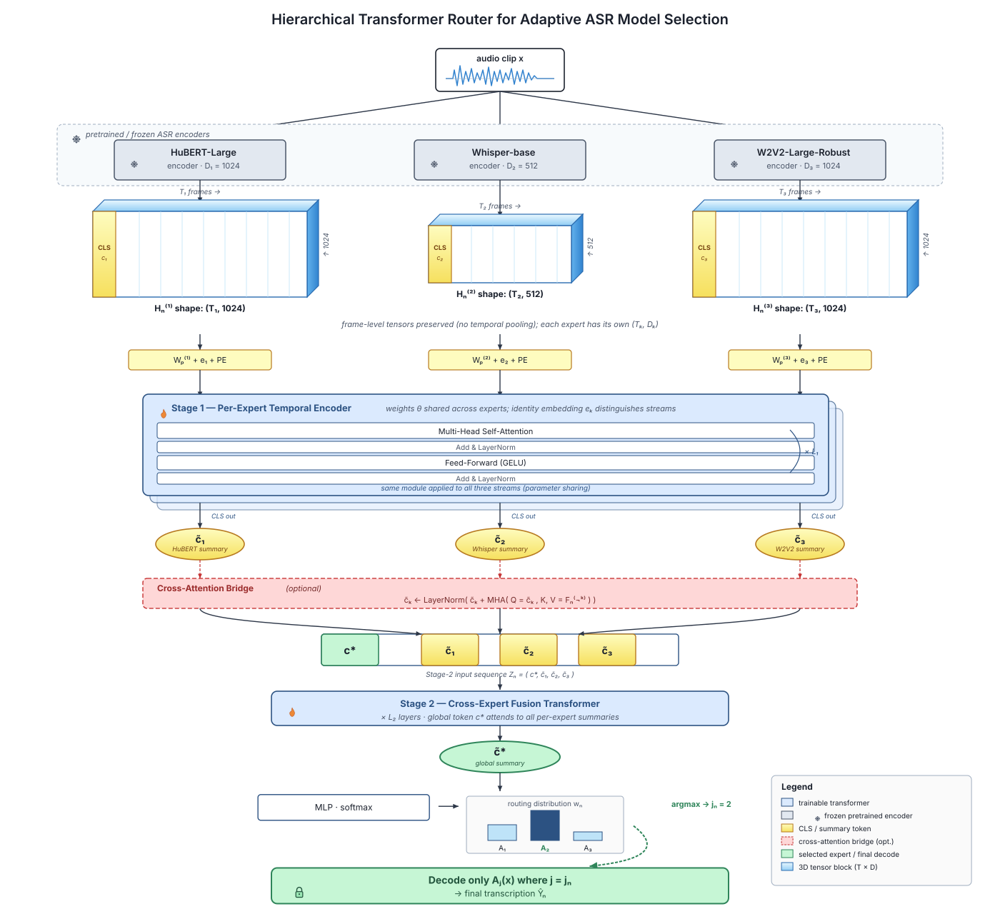

# HIT-ASR

**Hierarchical Transformer Routing for Adaptive ASR Expert Selection** — the reproducibility package.

Huseyin Karaca, A. Samil Namli, Suleyman S. Kozat — Bilkent University

[](https://huseyin-karaca.github.io/hit-asr)
[](https://huggingface.co/datasets/huseyin-karaca/hit-asr)

Pretrained ASR models have complementary strengths: on any one clip, one of them is usually clearly better than the
others. HIT-ASR picks that expert per clip. It reads the **frame-level encoder states** of every expert — not a
pooled summary — with a two-stage transformer: a first stage that models the temporal evidence within each expert,
and a cross-attention bridge that lets the experts' streams inform one another before one of them is chosen. Only the
chosen expert's decoder runs.



## Reproduce the paper

The main experiment is one notebook per corpus. Every model's hyperparameters are selected on a 25 % hold-out of the
corpus; every model is then trained and tested on the same ten folds of a 5×2 cross-validation of the remaining clips,
and HIT-ASR is compared with every other system on those folds.

| Notebook | What it reproduces | |
|---|---|---|
| [`main_ami_sdm`](notebooks/main_ami_sdm.ipynb) | Tables 1, 2, 3 and 6 on AMI (single distant microphone) | [](https://colab.research.google.com/github/huseyin-karaca/hit-asr/blob/main/notebooks/main_ami_sdm.ipynb) |
| [`main_earnings22`](notebooks/main_earnings22.ipynb) | the same on Earnings-22 | [](https://colab.research.google.com/github/huseyin-karaca/hit-asr/blob/main/notebooks/main_earnings22.ipynb) |
| [`main_peoples_speech`](notebooks/main_peoples_speech.ipynb) | the same on People's Speech | [](https://colab.research.google.com/github/huseyin-karaca/hit-asr/blob/main/notebooks/main_peoples_speech.ipynb) |
| [`main_afrispeech`](notebooks/main_afrispeech.ipynb) | the same on AfriSpeech-200 | [](https://colab.research.google.com/github/huseyin-karaca/hit-asr/blob/main/notebooks/main_afrispeech.ipynb) |
| [`ablation`](notebooks/ablation.ipynb) | the design switches of HIT-ASR and the number of experts | [](https://colab.research.google.com/github/huseyin-karaca/hit-asr/blob/main/notebooks/ablation.ipynb) |
| [`timing`](notebooks/timing.ipynb) | the cost on raw audio | [](https://colab.research.google.com/github/huseyin-karaca/hit-asr/blob/main/notebooks/timing.ipynb) |
| [`synthetic`](notebooks/synthetic.ipynb) | the synthetic regime-switch check | [](https://colab.research.google.com/github/huseyin-karaca/hit-asr/blob/main/notebooks/synthetic.ipynb) |
| [`manuscript_tables`](notebooks/manuscript_tables.ipynb) | every table of the paper, written to [`tables/`](tables) | [](https://colab.research.google.com/github/huseyin-karaca/hit-asr/blob/main/notebooks/manuscript_tables.ipynb) |
| [`extract`](notebooks/extract.ipynb) | the experts' labels and frames, rebuilt from the audio (level 3) | [](https://colab.research.google.com/github/huseyin-karaca/hit-asr/blob/main/notebooks/extract.ipynb) |

Each notebook runs at one of three levels (`LEVEL` in its first cell):

| Level | What runs | Needs |
|---|---|---|
| **1** | every table, from the searches, folds and records stored on the Hub | a CPU, minutes |
| **2** | every model retrained from the published labels and frames | a GPU, hours |
| **3** | level 2 on labels and frames rebuilt from the audio (`extract`) | a GPU |

Levels 1 and 2 need no account and no token. The notebooks are committed with the outputs of a level-1 run.

Locally:

```bash
pip install "hit-asr[paper] @ git+https://github.com/huseyin-karaca/hit-asr"
python -m hitasr.experiment ami_sdm --device cpu      # level 1 of main_ami_sdm as a script
```

## Reproducibility, tested

We re-ran this package from scratch, as a reader would: the public code, the public dataset, a read-only token, on
Google Colab and on rented cloud GPUs (vast.ai) with our Docker images.

- **Level 1** reproduces every table of the paper **exactly**, on all four corpora — from a fresh download on a
  laptop or in the `ghcr.io/huseyin-karaca/hit-asr:cpu` container.
- **Level 2** retrains every model: every baseline comes back **identical to the last digit**; HIT-ASR varies run to run
  as GPU-trained transformers do, and matched the published corpus WER to the fifth decimal on Earnings-22 and
  People's Speech.
- **Level 3** rebuilds the experts' outputs from the raw audio: frame-level encoder states with cosine similarity
  1.000000, identical transcripts for five of the seven experts, every expert's corpus WER within 0.0015.
- **Cost:** level 1 runs on any CPU in minutes; level 2 takes 35–80 minutes per corpus on Colab's G4 (5–11 compute
  units); the `ghcr.io/huseyin-karaca/hit-asr:cuda` image runs Earnings-22 on a rented 24 GB card (RTX 3090 / A5000)
  for about US$0.45 at level 2 and US$1 at level 3.

The [reproducibility report](https://huseyin-karaca.github.io/hit-asr/reproducibility/) has the measurements, the
time and cost per corpus and level, and the minimum hardware.

## What is where

```
notebooks/        the notebooks
tables/           the paper's tables as LaTeX, written by notebooks/manuscript_tables
src/hitasr/       the paper: the configurations (configs), the main experiment (experiment), the routers and every
                  baseline, the search, the cross-validation, the ablation, the cost measurement, the tables (paper)
src/labkit/       the experiment machinery: Hub repos as a cache, result caches, search spaces, 5x2 splits, the
                  paired test, tables
docs/             the documentation site
```

The data — the audio at 16 kHz, every expert's transcripts and word-error counters, their frame-level encoder
states, and the stored searches, folds and records — is the Hugging Face dataset
[`huseyin-karaca/hit-asr`](https://huggingface.co/datasets/huseyin-karaca/hit-asr). Each corpus's part carries that
corpus's licence; see the [documentation](https://huseyin-karaca.github.io/hit-asr/data/).

## Citation

See [`CITATION.cff`](CITATION.cff).

## Licence

The code is Apache-2.0 ([`LICENSE`](LICENSE)). The data on the Hub keeps the licence of the corpus it comes from.
